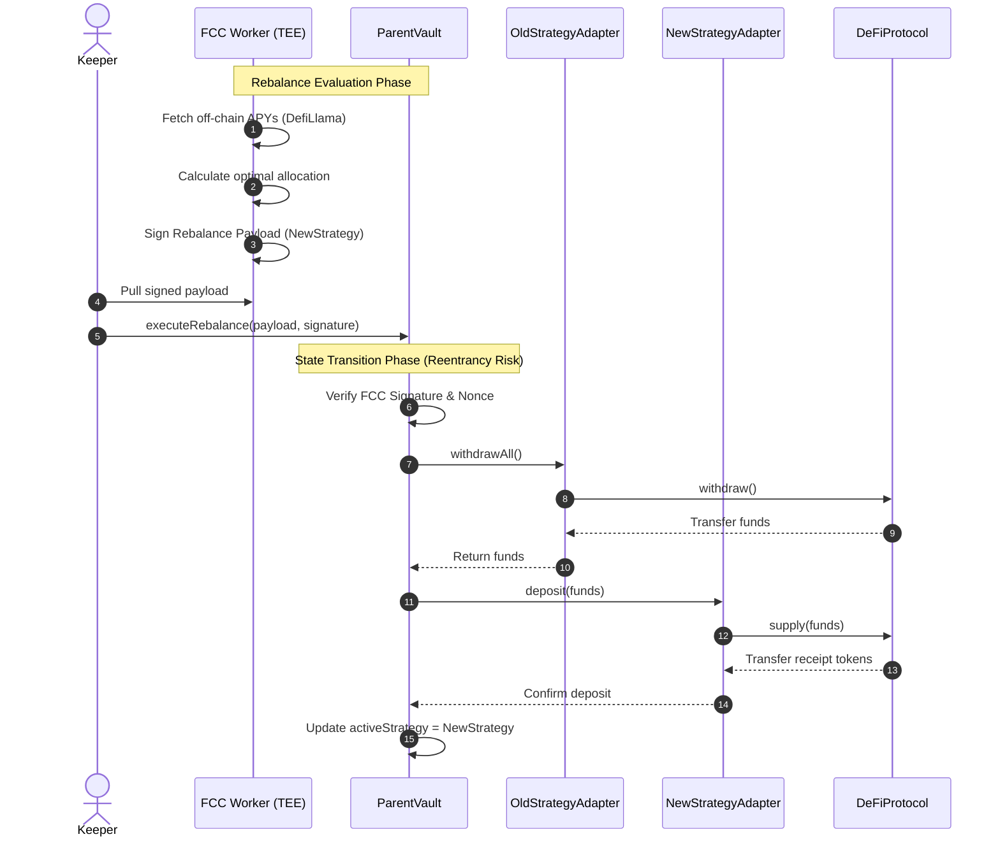
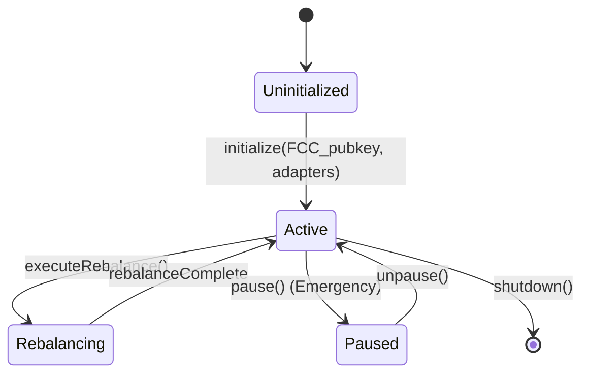
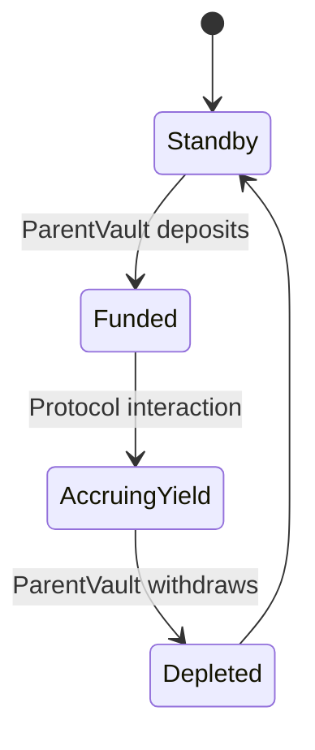

# Flare-Native Idle Capital Manager (YieldCoin Adaptation)

## 1. Markdown Specification

### Overview
This architecture adapts the original YieldCoin design (built on Chainlink) to a purely Flare-native stack. The primary difference is the complete removal of Chainlink CCIP, Automation, and Functions. Instead, this system utilizes:
- **FAssets / Flare Data Connector (FDC)**: Replaces CCIP for cross-chain state verification and bridging logic.
- **Flare Confidential Compute (FCC)**: Replaces Chainlink Functions. A Trusted Execution Environment (TEE) off-chain worker securely fetches DefiLlama APYs and executes the rebalance strategy privately to prevent MEV front-running.
- **Native / Keeper Triggers**: Replaces Chainlink Automation. Simple off-chain bots or FCC itself will trigger the periodic rebalancing evaluation.

### Actors / Roles
- **Depositor**: An end-user providing stablecoins (or underlying assets like XRP/BTC) to the system in exchange for YieldCoin (the share token).
- **FCC Off-chain Worker (The Strategist)**: A TEE-based secure enclave responsible for reading external APYs, calculating the optimal allocation, and cryptographically signing the rebalance instructions.
- **Relayer / Keeper**: An externally owned account (EOA) or automated script that submits the FCC-signed rebalance payload to the blockchain and triggers state transitions.
- **FAsset System**: The underlying Flare network protocol responsible for minting representations of non-smart contract tokens (like FXRP/FBTC) via Direct Minting.

### Contracts & Responsibilities
- **`YieldToken` (Share Token)**: An ERC20 (or ERC677) token representing a user's fractional ownership of the vault's total value. It is minted upon deposit and burned upon withdrawal.
- **`ParentVault` (Core Logic & State)**: The central contract deployed on Flare. It holds the canonical state of total shares, total underlying value, and the currently active strategy. It validates signatures from the FCC worker before accepting a strategy update.
- **`FAssetAdapter`**: Handles the FAssets Direct Minting mechanics. It interacts with the `MintingTagManager` and FAsset core contracts to route user deposits into yield-bearing FAssets.
- **`StrategyAdapter(s)`**: Modular contracts (e.g., `AaveAdapter`, `KineticAdapter`) that wrap the specific deposit/withdraw logic for different DeFi protocols on Flare.

### State Model
- **`ParentVault` State**: Tracks the total active shares, the total recognized value across all strategies, the current active strategy address, and the nonce for FCC rebalance payloads to prevent replay attacks.
- **`StrategyAdapter` State**: Tracks the specific amount of capital allocated to its underlying protocol and the accumulated yield.
- **`YieldToken` State**: Tracks standard ERC20 balances, allowances, and total supply.

### Interactions
- **Deposit**: User sends assets to `ParentVault` → `ParentVault` forwards assets to `FAssetAdapter` (if bridging) or `StrategyAdapter` (if already on Flare) → `ParentVault` calculates shares based on `TotalValue` and mints `YieldToken` to the user.
- **Withdraw**: User burns `YieldToken` at `ParentVault` → `ParentVault` requests funds from `StrategyAdapter` → Assets are returned to the user.
- **Rebalance**: FCC Worker calculates optimal strategy → Signs a payload → Keeper submits payload to `ParentVault` → `ParentVault` verifies signature → Withdraws all funds from `OldStrategyAdapter` → Deposits funds into `NewStrategyAdapter`.

### Storage Layout
*(See Section 5 for detailed tables)*

### Open Questions
1. **FAsset Deposit Flow**: Will users deposit native stablecoins directly on Flare, or will they deposit on an underlying chain (e.g., XRP Ledger) and use Tag-based Direct Minting to automatically route into the `ParentVault`?
2. **FCC Trust Assumption**: How will the `ParentVault` verify the FCC worker? Will it use a simple ECDSA signature from an authorized enclave key, or a more complex remote attestation verification?
3. **Yield Realization**: Should the yield be auto-compounded within the strategy, or periodically harvested and converted to FLR to stake into the FTSO?

---

## 2. Sequence Diagram: Rebalance & Cross-Contract Calls



---

## 3. State Diagrams

### `ParentVault` Lifecycle


### `StrategyAdapter` Lifecycle


---

## 4. System Flowchart

```mermaid
flowchart TD
    User([User / Depositor])
    Keeper([Rebalance Keeper])
    FCC{{Flare Confidential Compute (TEE)}}
    
    subgraph Flare Network
        YToken[YieldToken / Share]
        PVault[ParentVault]
        FAssetA[FAssetAdapter]
        StratA[AaveStrategyAdapter]
        StratB[KineticStrategyAdapter]
        
        subgraph Flare Core
            FAssets((FAssets System))
            FTSO((FTSO))
        end
        
        subgraph External DeFi
            Aave[(Aave V3)]
            Kinetic[(Kinetic Finance)]
        end
    end
    
    User -- "Deposits Assets" --> PVault
    PVault -- "Mints Shares" --> YToken
    
    PVault -- "Routes (if bridging)" --> FAssetA
    FAssetA -- "Direct Minting" --> FAssets
    
    PVault -- "Deploys Capital" --> StratA
    PVault -- "Deploys Capital" --> StratB
    
    StratA -- "Supplies Liquidity" --> Aave
    StratB -- "Supplies Liquidity" --> Kinetic
    
    FCC -. "Reads On-chain State" .-> PVault
    FCC -. "Fetches APYs" .-> ExternalAPIs[(External APIs)]
    FCC -- "Signs Instructions" --> Keeper
    Keeper -- "Submits Payload" --> PVault
```

---

## 5. Storage Tables

### `ParentVault` Storage

| Variable Name | Type | Purpose |
| --- | --- | --- |
| `owner` | `address` | Contract administrator (can upgrade/pause) |
| `yieldToken` | `address` | Address of the YieldCoin ERC20 share token |
| `activeStrategy` | `address` | The currently active `StrategyAdapter` holding the funds |
| `fccPublicKey` | `address` | The authorized address representing the FCC TEE enclave |
| `totalUnderlying` | `uint256` | Cached value of all assets across strategies |
| `nonce` | `uint256` | Replay protection for FCC-signed rebalance payloads |
| `isPaused` | `bool` | Emergency circuit breaker state |

### `StrategyAdapter` Storage

| Variable Name | Type | Purpose |
| --- | --- | --- |
| `vault` | `address` | Address of the `ParentVault` (only address allowed to call) |
| `underlyingAsset` | `address` | The stablecoin or FAsset being managed |
| `receiptToken` | `address` | The yield-bearing token (e.g., aUSDC) from the DeFi protocol |
| `protocolRouter` | `address` | The entry point for the external DeFi protocol |

### `YieldToken` Storage

| Variable Name | Type | Purpose |
| --- | --- | --- |
| `totalSupply` | `uint256` | Total amount of YieldCoin in circulation |
| `balances` | `mapping(address => uint256)` | Individual user share balances |
| `vault` | `address` | Address of the `ParentVault` (only entity allowed to mint/burn) |

## 7. Deep-Dive: Flare Confidential Compute (FCC) Signature Verification

Since we are replacing Chainlink Functions/Automation with Flare's Trusted Execution Environment (TEE) worker, our `ParentVault` needs a robust, trust-minimized way to verify that a rebalance instruction actually came from the secure enclave and hasn't been tampered with or replayed.

**Implementation Mechanics:**

1.  **Enclave Keypair Generation**: Inside the TEE, the FCC worker generates a standard ECDSA keypair (secp256k1). The private key never leaves the enclave. The corresponding public address (`fccSignerAddress`) is provided to the `ParentVault` during deployment or initialization.
2.  **Payload Construction**: When the TEE calculates a new optimal strategy, it constructs a payload containing:
    *   `newStrategyAdapter` (address): Where funds should move.
    *   `nonce` (uint256): The current nonce expected by the `ParentVault` to prevent replay attacks.
    *   `deadline` (uint256): A timestamp after which the signature expires.
3.  **Signing**: The TEE hashes this payload (using EIP-712 standard or simple `keccak256`) and signs it with its private key, producing `v, r, s` signature components.
4.  **On-Chain Verification (`ParentVault.sol`)**:
    *   The Keeper calls `executeRebalance(address newStrategy, uint256 deadline, bytes memory signature)`.
    *   The vault rebuilds the hash: `bytes32 hash = keccak256(abi.encodePacked(newStrategy, nonce, deadline, address(this)));`
    *   The vault verifies the deadline: `require(block.timestamp <= deadline, "Expired");`
    *   Using OpenZeppelin's `ECDSA` library, the vault recovers the signer: `address signer = ECDSA.recover(hash, signature);`
    *   It checks authorization: `require(signer == fccSignerAddress, "Invalid FCC Signature");`
    *   Finally, it increments the nonce: `nonce++;` and executes the withdrawal from the old strategy and deposit to the new one.

---

## 8. Deep-Dive: FAssets Direct Minting via Tags

Direct Minting is perfect for our vault because it removes the friction of multi-step collateral reservation for users depositing non-smart contract assets (like XRP or BTC).

**Implementation Mechanics:**

1.  **Tag Registration (`FAssetAdapter.sol`)**:
    *   The `FAssetAdapter` acts as a factory, registering a *unique* destination tag on the underlying chain (e.g., an XRP Ledger Destination Tag) for every individual user who registers with the DApp.
    *   It maintains a mapping of `Tag -> UserAddress`.
2.  **The User Deposit Flow**:
    *   A user wants to deposit XRP into the Yield Manager.
    *   They send native XRP directly to an FAsset Core Vault address, including their unique Destination Tag.
    *   *No interaction on Flare is required from the user.*
3.  **Automatic Routing on Flare**:
    *   The FAsset system detects the underlying payment. Because of the destination tag, it automatically mints FXRP and sends it directly to our `FAssetAdapter`.
    *   When the mint arrives, the adapter checks the tag, looks up the corresponding `UserAddress`, forwards the FAssets to the `ParentVault`, and instructs the vault to mint `YieldToken` shares to the user.

## 9. FTSO Integration & Yield Compounding

To maximize returns for depositors, the Yield Manager will not just hold yield-bearing tokens, but actively compound them using Flare's native FTSO (Flare Time Series Oracle) rewards.

**Implementation Mechanics:**
1. **Yield Harvesting**: The `ParentVault` or an authorized Keeper periodically calls a `harvest()` function on the active `StrategyAdapter`.
2. **Conversion to FLR**: Any non-FLR yield (e.g., USDC, aUSDC) is swapped for native FLR using a Flare-native DEX (like SparkDEX or Enosys).
3. **FTSO Delegation**: 
   - The `ParentVault` wraps the FLR into WNAT (Wrapped Native).
   - The vault delegates the WNAT voting power to top-performing FTSO data providers.
4. **Reward Claiming**: A scheduled keeper task claims the FTSO epoch rewards (which are paid in FLR) every 3.5 days, wrapping them back into WNAT to automatically compound the voting power and increase the total Underlying Value of the vault.

---

## 10. MEV Capture Strategy

When the FCC Enclave decides to rebalance the vault, shifting millions of dollars from one DeFi protocol to another creates massive arbitrage opportunities. Instead of leaking this value to public mempool searchers, the vault will capture it.

**Implementation Mechanics:**
1. **Private Transaction Routing**: The Keeper executing the FCC-signed payload does *not* broadcast the rebalance transaction to the public mempool. Instead, it is sent via a private RPC endpoint to prevent sandwich attacks.
2. **Backrun Auction (MEV Share)**:
   - The FCC enclave signs a "Rebalance Intent".
   - The vault allows authorized MEV searchers to execute the rebalance transaction *if* they backrun the trade (e.g., arbitrage the price impact on the DEX) and return a percentage of the arbitrage profit directly to the `ParentVault`.
   - The `executeRebalance` function is modified to: `executeRebalance(payload, searcherBribe)`.
   - The vault only accepts the transaction if `searcherBribe > minimumAcceptableBribe`.
3. **Result**: The value generated by moving the vault's massive liquidity is internalized and distributed to the YieldCoin holders as additional APY.

---

## 11. Frontend Architecture & User Flow

The user interface abstracts the complexity of FAssets, FDC, and cross-chain routing so the user experiences a simple 1-click deposit.

**Tech Stack:**
- **Framework**: React (Vite)
- **Styling**: Tailwind CSS + Shadcn UI (for a premium, modern dark-mode aesthetic)
- **Web3 Integration**: `wagmi` + `viem` for Flare connections.
- **Wallet Support**: MetaMask, Coinbase Wallet (for EVM), and Xumm (for XRP Ledger Direct Minting).

**Flow A: The "1-Click" Cross-Chain Deposit**
1. **Connect**: User connects their underlying wallet (e.g., Xumm for XRP).
2. **Allocate**: User enters the amount of XRP to deposit and clicks "Earn Yield".
3. **Register Tag (Background)**: The frontend connects to Flare via a relayer to call `FAssetAdapter.registerUserTag()` and fetches the user's unique destination tag.
4. **Send**: The frontend prompts the user's XRP wallet to sign a standard XRP transfer to the FAsset Core Vault, with the destination tag attached.
5. **Wait & Receive**: The UI shows a progress bar. Once the FDC proves the payment, the user's Flare wallet automatically reflects their new `YieldCoin` balance.

**Flow B: The Dashboard**
- **Hero Section**: Displays "Total Value Locked (TVL)", "Current Blended APY", and "Your YieldCoin Balance".
- **Strategy Visualizer**: A dynamic flowchart showing exactly where the vault's funds are currently deployed (e.g., "70% in Kinetic, 30% in Aave") and the real-time FTSO delegation status.
- **Recent Activity**: A feed of recent FCC-triggered rebalances and MEV capture events.

---

## 12. Protocol Monetization (Fees)

To sustain the protocol, the yield manager takes a small performance fee purely on generated yield, rather than taxing user principal deposits.

**Implementation Mechanics:**
- A `treasury` address is stored in the `ParentVault`.
- The fee is set to a standard **10% Performance Fee** on *newly generated yield*.
- When the `harvest()` function is called to claim FTSO rewards or strategy APY, the contract calculates the new value generated since the last harvest.
- It then mints 10% of that new value as `YieldCoin` shares directly to the `treasury` address, allowing the protocol to earn and auto-compound alongside the users.

---

## 13. Security & Upgradeability

Since DeFi strategy APIs frequently change, the protocol must be upgradeable without requiring users to migrate funds or breaking the state.

**Implementation Mechanics:**
1. **UUPS Proxy Pattern**: The `ParentVault` will be deployed behind a UUPS (Universal Upgradeable Proxy Standard) proxy (EIP-1822). This allows the logic contract to be swapped while the state and fund balances remain perfectly intact.
2. **Circuit Breaker**: The vault implements OpenZeppelin's `Pausable` extension.
   - If an underlying DeFi protocol gets hacked, the `owner` can call `pause()`.
   - This instantly blocks all `deposit()`, `withdraw()`, and `executeRebalance()` functions, freezing the funds in their current state until the issue is resolved or a new upgrade is pushed.
