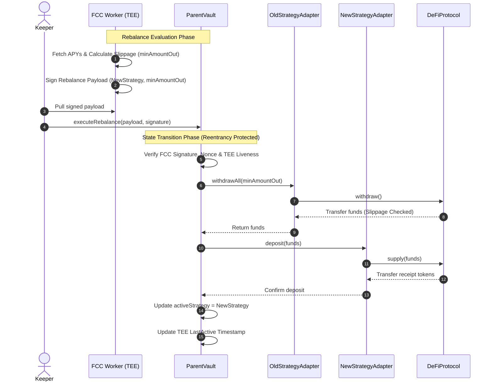
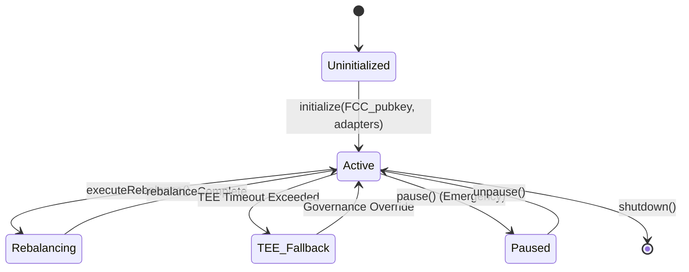
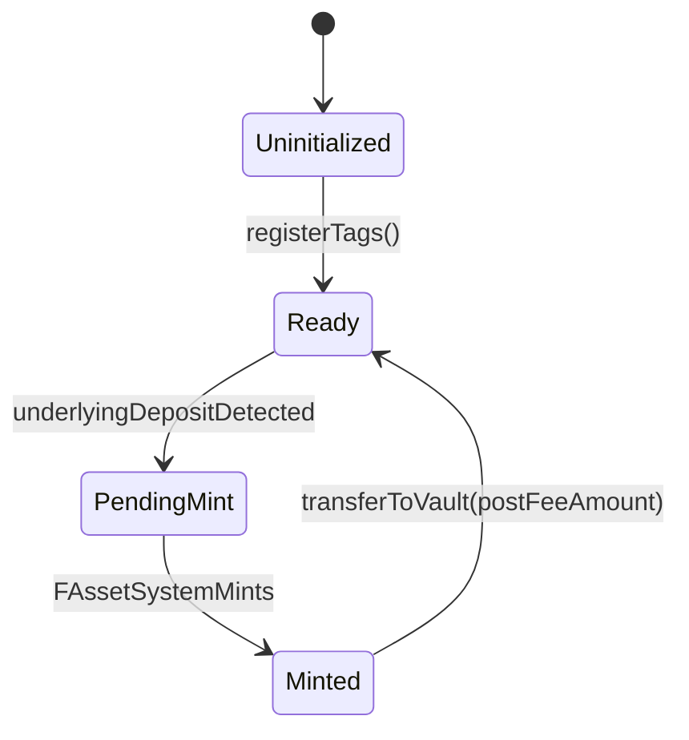

# Flare-Native Idle Capital Manager (YieldCoin Adaptation)

## 1. Markdown Specification

### Overview
This architecture adapts the original YieldCoin design to a purely Flare-native stack, replacing Chainlink CCIP and Functions with Flare's FAssets, FDC, and Flare Confidential Compute (FCC). This updated version addresses asynchronous minting arbitrage, TEE liveness failures, FAsset executor fee slippage, FTSO liquidity crunches, and MEV-sandwiching during rebalancing.

### Actors / Roles
- **Depositor**: End-user providing underlying assets (e.g., XRP, BTC) to the system in exchange for YieldCoin (the share token).
- **FCC Off-chain Worker (The Strategist)**: A TEE-based secure enclave responsible for reading external APYs, calculating the optimal allocation, and cryptographically signing the rebalance instructions with slippage parameters.
- **Relayer / Keeper**: An externally owned account (EOA) or automated script that submits the FCC-signed rebalance payload to the blockchain and triggers state transitions.
- **FAsset System**: The underlying Flare network protocol responsible for minting representations of non-smart contract tokens via Direct Minting.
- **FTSO**: The Flare Time Series Oracle, which provides price feeds and yield (via delegation) for wrapped FLR.

### Contracts & Responsibilities
- **`YieldToken` (Share Token)**: An ERC20 token representing a user's fractional ownership of the vault's total value. Minted upon realized deposit, burned upon withdrawal.
- **`ParentVault` (Core Logic & State)**: The central contract deployed on Flare. It holds the canonical state of total shares, total underlying value, active strategy, pending deposit queue (to prevent asynchronous minting arbitrage), liquidity buffer (for immediate withdrawals), and a TEE fallback mechanism.
- **`FAssetAdapter`**: Handles FAssets Direct Minting mechanics. Uses Tag-based minting to automatically route user deposits into the `ParentVault`. Accounts for executor fee slippage to prevent share dilution.
- **`StrategyAdapter(s)`**: Modular contracts (e.g., `AaveAdapter`, `KineticAdapter`) wrapping specific deposit/withdraw logic for different DeFi protocols on Flare.

### State Model
- **`ParentVault` State**: Tracks total active shares, total recognized value across all strategies, current active strategy address, nonce for FCC payloads, pending withdrawals, and TEE fallback timestamps.
- **`StrategyAdapter` State**: Tracks capital allocated to its protocol and accumulated yield.
- **`YieldToken` State**: Tracks standard ERC20 balances, allowances, and total supply.
- **`FAssetAdapter` State**: Tracks registered minting tags and maps them to user addresses for attribution.

### Interactions
- **Deposit (Asynchronous)**: User sends assets to FAsset Core Vault with Tag → FAssets minted to `FAssetAdapter` → `FAssetAdapter` calculates post-fee amount → `ParentVault` locks price at execution block and mints `YieldToken` to user.
- **Withdraw**: User burns `YieldToken` at `ParentVault` → `ParentVault` fulfills from Liquidity Buffer (if sufficient) or queues withdrawal → If queued, waits for FTSO epoch end or strategy withdrawal → Assets returned via FAsset Redemption.
- **Rebalance**: FCC Worker calculates optimal strategy & slippage limits → Signs payload → Keeper submits to `ParentVault` → `ParentVault` verifies signature & limits → Withdraws from `OldStrategyAdapter` → Deposits into `NewStrategyAdapter`.
- **Emergency Fallback**: If FCC is offline for X days, DAO/Multisig triggers force-withdrawal to `ParentVault`.

### Storage Layout
*(See Section 5 for detailed tables)*

### Open Questions
1. **Liquidity Buffer Sizing**: What percentage of TVL should be kept liquid to satisfy immediate withdrawals without dragging down overall yield?
2. **Tag Registration Cost**: Is there a spam-prevention cost for registering thousands of unique tags on the `MintingTagManager`?
3. **FAsset Redemption Flow**: Direct Minting is well-defined, but how will the asynchronous nature of FAsset *redemption* affect the user's withdrawal UX?

---

## 2. Sequence Diagram: Rebalance & Cross-Contract Calls



---

## 3. State Diagrams

### `ParentVault` Lifecycle


### `FAssetAdapter` Lifecycle


---

## 4. System Flowchart

```mermaid
flowchart TD
    User([User / Depositor])
    Keeper([Rebalance Keeper])
    FCC{{Flare Confidential Compute (TEE)}}
    DAO([DAO / Multisig Fallback])
    
    subgraph Flare Network
        YToken[YieldToken / Share]
        PVault[ParentVault]
        FAssetA[FAssetAdapter]
        StratA[AaveStrategyAdapter]
        StratB[KineticStrategyAdapter]
        
        subgraph Flare Core
            FAssets((FAssets System))
            FTSO((FTSO))
        end
        
        subgraph External DeFi
            Aave[(Aave V3)]
            Kinetic[(Kinetic Finance)]
        end
    end
    
    User -- "Deposits (XRPL/BTC) with Tag" --> FAssets
    FAssets -- "Direct Mints (Post-Fee)" --> FAssetA
    FAssetA -- "Routes Assets" --> PVault
    PVault -- "Mints Shares (Current Block Price)" --> YToken
    
    PVault -- "Deploys Capital" --> StratA
    PVault -- "Deploys Capital" --> StratB
    PVault -- "Maintains Liquidity Buffer" --> PVault
    
    StratA -- "Supplies Liquidity" --> Aave
    StratB -- "Supplies Liquidity" --> Kinetic
    StratB -- "Delegates for Yield" --> FTSO
    
    FCC -. "Reads On-chain State" .-> PVault
    FCC -- "Signs Instructions (Slippage Protected)" --> Keeper
    Keeper -- "Submits Payload" --> PVault
    
    DAO -- "Force Withdraw if TEE Fails" --> PVault
```

---

## 5. Storage Tables

### `ParentVault` Storage

| Variable Name | Type | Purpose |
| --- | --- | --- |
| `owner` | `address` | Contract administrator (can upgrade/pause/trigger fallback) |
| `yieldToken` | `address` | Address of the YieldCoin ERC20 share token |
| `activeStrategy` | `address` | The currently active `StrategyAdapter` holding the funds |
| `fccPublicKey` | `address` | The authorized address representing the FCC TEE enclave |
| `totalUnderlying` | `uint256` | Cached value of all assets across strategies and buffer |
| `nonce` | `uint256` | Replay protection for FCC-signed rebalance payloads |
| `isPaused` | `bool` | Emergency circuit breaker state |
| `teeLastActive` | `uint256` | Timestamp of last valid rebalance (for Liveness Fallback) |
| `liquidityBuffer` | `uint256` | Amount of un-deployed capital kept for instant withdrawals |

### `FAssetAdapter` Storage

| Variable Name | Type | Purpose |
| --- | --- | --- |
| `vault` | `address` | Address of the `ParentVault` (only address allowed to call) |
| `userTags` | `mapping(uint256 => address)` | Maps a registered FAsset Direct Minting Tag to a User Address |
| `pendingDeposits` | `mapping(address => uint256)` | Tracks FAssets received but not yet realized as YieldTokens |

### `StrategyAdapter` Storage

| Variable Name | Type | Purpose |
| --- | --- | --- |
| `vault` | `address` | Address of the `ParentVault` (only address allowed to call) |
| `underlyingAsset` | `address` | The stablecoin or FAsset being managed |
| `receiptToken` | `address` | The yield-bearing token (e.g., aUSDC) from the DeFi protocol |
| `protocolRouter` | `address` | The entry point for the external DeFi protocol |

### `YieldToken` Storage

| Variable Name | Type | Purpose |
| --- | --- | --- |
| `totalSupply` | `uint256` | Total amount of YieldCoin in circulation |
| `balances` | `mapping(address => uint256)` | Individual user share balances |
| `vault` | `address` | Address of the `ParentVault` (only entity allowed to mint/burn) |
