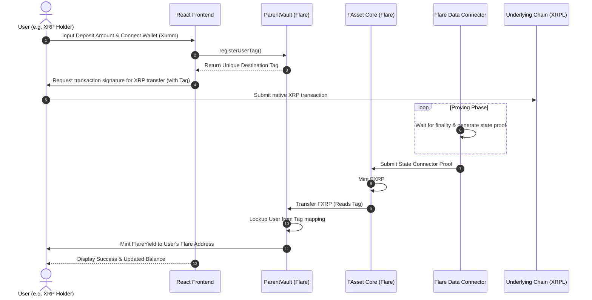
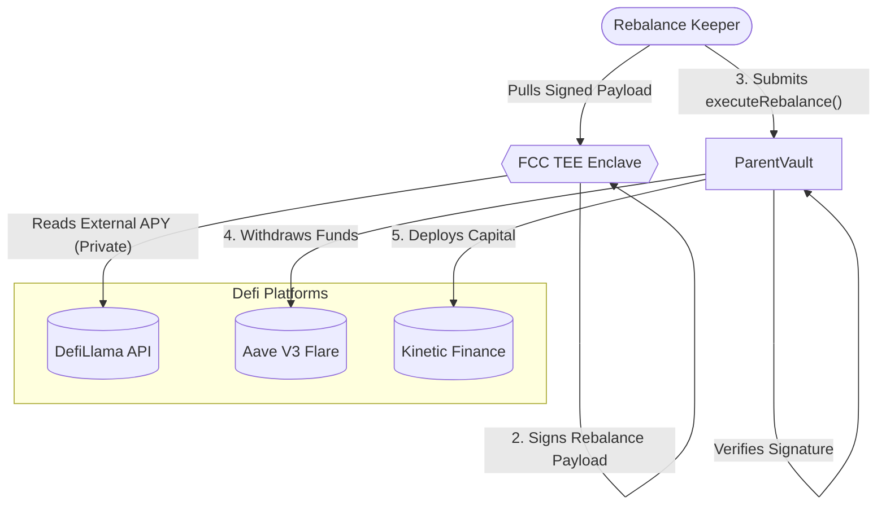
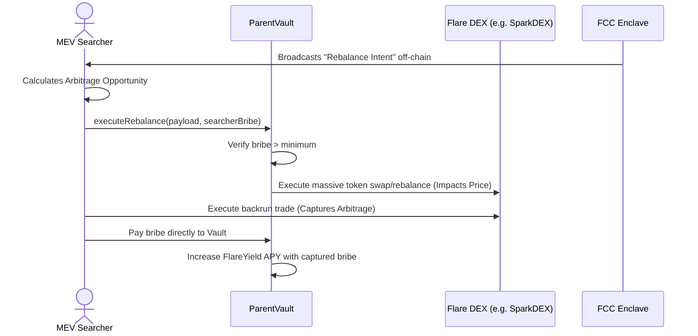
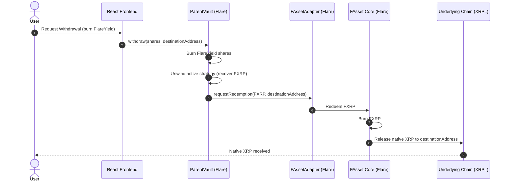

# Platform Overview & System Architecture

This document visually maps the overarching architecture of the Flare-Native Yield Manager, from cross-chain deposits down to MEV capture mechanics.

## 1. The Cross-Chain "1-Click" Deposit Lifecycle

The system removes bridging friction by utilizing Flare's FAsset Direct Minting in the background.

## 2. Yield Optimization & Rebalancing Engine

The Flare Confidential Compute (FCC) enclave ensures private, trustless calculation of optimal yields.

## 3. MEV Capture & Backrun Auction

Rather than leaking arbitrage value to public searchers during massive rebalances, the protocol internalizes it.

## 4. FAsset Redemption (The Withdrawal Flow)

When a user wants to exit the protocol and receive their native underlying assets back (e.g. native XRP).

