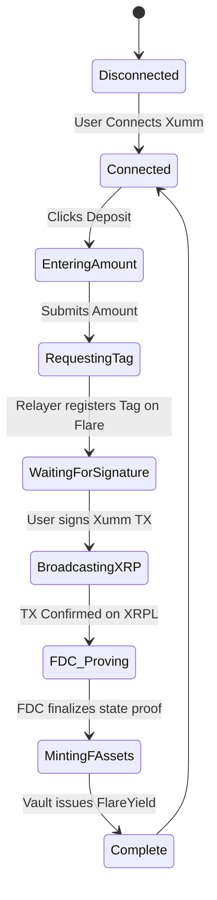

# Frontend Architecture

This document describes the structure, state management, and wallet connection strategies for the Flare-Native Yield Manager React (Vite) frontend application.

## 1. Dual-Wallet Architecture

Because the platform bridges non-smart contract assets (like XRP and BTC) directly into Flare using FAssets, the frontend must handle two distinct wallet environments.

### Wallet Integrations
- **EVM (Flare Network)**: 
  - Managed via `wagmi` and `viem`.
  - Supports **MetaMask** and **Coinbase Wallet**.
  - Used for viewing FlareYield balances, tracking FTSO compounding, and interacting with the `ParentVault` directly if the user is already on Flare.
- **Non-EVM (e.g., XRP Ledger)**: 
  - Managed via dedicated chain SDKs (e.g., Xumm SDK for XRP).
  - Used strictly to initiate the "1-Click Direct Minting Deposit" by prompting the user to send native tokens to the FAsset Core Vault with their registered destination tag.

## 2. React Component Hierarchy

The frontend is built for simplicity, focusing all complexity into the backend smart contracts and FDC relayers.

```text
src/
├── App.tsx                  # Main router and Context Provider wrapper
├── contexts/
│   ├── EvmWalletContext.tsx # Wagmi config provider
│   └── XrpWalletContext.tsx # Xumm/Crossmark config provider
├── layouts/
│   └── DashboardLayout.tsx  # Sidebar (Nav), Header (Wallet Connect), Main Content
├── pages/
│   ├── Dashboard.tsx        # The primary user interface (TVL, APY, Deposit)
│   └── Documentation.tsx    # In-App docs rendered from Markdown
└── components/
    ├── DepositModal.tsx     # The UI for entering amounts and triggering the mint
    ├── StrategyChart.tsx    # Real-time visualizer of where funds are deployed
    └── ActivityFeed.tsx     # Feed showing recent MEV captures and Rebalances
```

## 3. The 1-Click Deposit State Machine

The hardest UX challenge is abstracting the multi-step FAsset Direct Minting process. The frontend handles this via a robust state machine.



## 4. In-App Documentation Integration

To fulfill the requirement that documentation is a single source of truth:
1. The `docs/` folder in the root of the repository holds all Markdown files.
2. The Vite bundler is configured to expose the `docs/` folder as static assets.
3. The `Documentation.tsx` React component fetches `platform_overview.md`, `architecture.md`, and others.
4. It parses them using `react-markdown`.
5. It renders the Mermaid diagrams directly in the browser using the `remark-mermaidjs` plugin.
6. **Result**: The end-user sees exactly the same blueprints the developers see, directly inside the app, without leaving the UI.
